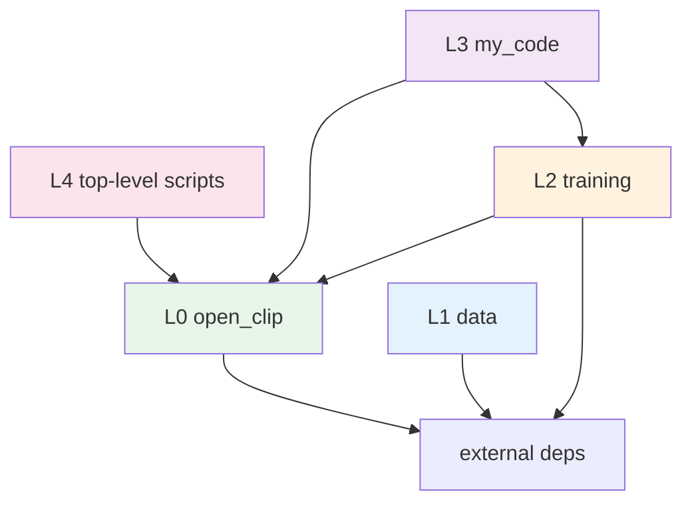
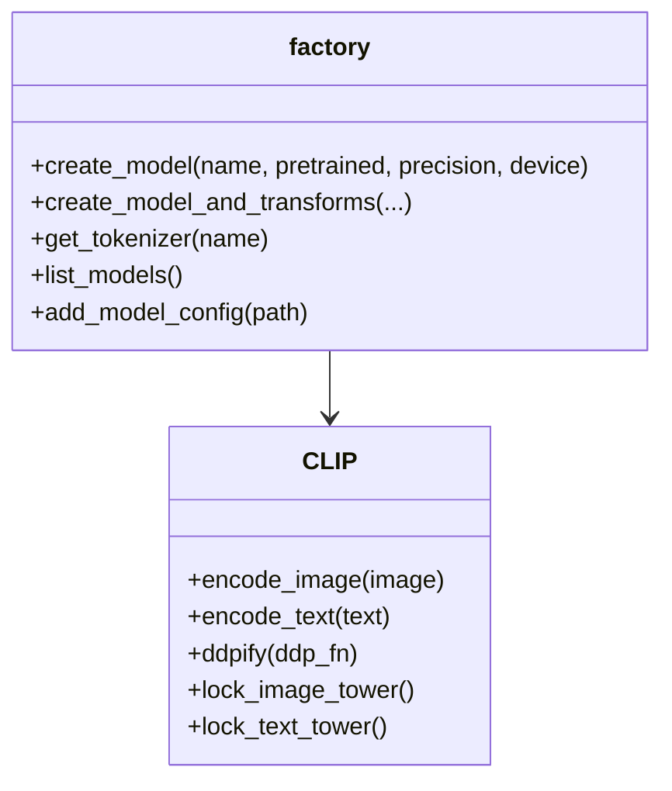
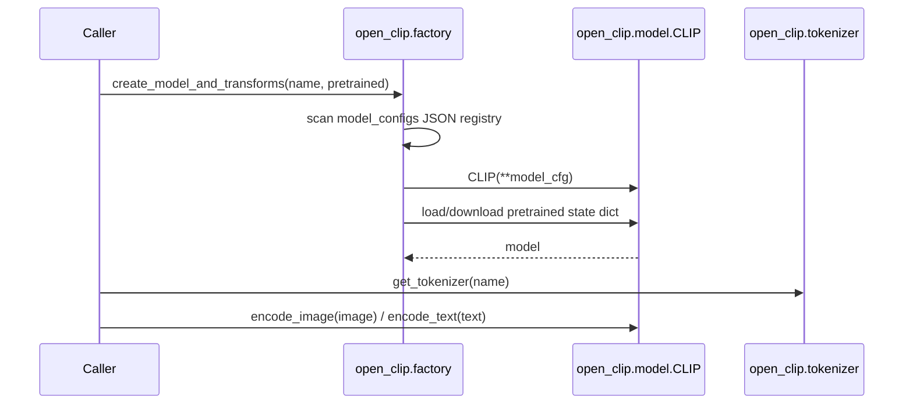
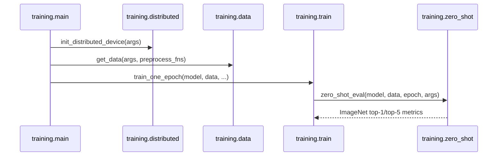

# Architecture

> Last regenerated: 2026-08-25
> Source analysis: `src/open_clip`, `src/training`, `src/data`, `my_code`, top-level Python scripts.

## 1 Overview

TinyCLIP is a PyTorch implementation of cross-modal distillation from a larger
CLIP model to a smaller one. The repository combines a reusable CLIP model
library under `src/open_clip/`, a distributed training pipeline under
`src/training/`, and local experiment scripts under `my_code/`.

The reusable package is `open_clip_torch`, installed from `setup.py` and
exposed as `open_clip`. Training code is deliberately excluded from the
installed package and is executed from `src/` on `PYTHONPATH`.

> Sources: [setup.py:21-39](), [src/open_clip/__init__.py:1-11](),
> [src/training/main.py:41-47]().

## 2 System Architecture

### 2.1 Package Dependency Graph

### 2.2 Layer Hierarchy

| Layer | Path / Package | Can Import | Cannot Import |
|-------|----------------|------------|----------------|
| L0 | `src/open_clip/` | Python stdlib, PyTorch, `timm`, `torchvision` | `training`, `data`, `my_code`, top-level scripts |
| L1 | `src/data/` | external data/network libraries | `open_clip`, `training`, `my_code` |
| L2 | `src/training/` | `open_clip`, its own submodules | `my_code`, top-level scripts |
| L3 | `my_code/` | `open_clip`, `training`, its own submodules | nothing imports it |
| L4 | `inference.py`, `measure_throughput.py`, `setup.py` | `open_clip` | nothing imports them |

> Enforced by: [scripts/lint_deps.py]().

### 2.3 Forbidden Dependencies

- `open_clip` must not import `training`, `data`, `my_code`, or top-level
  entry points. The model library is reusable without the trainer.
- `training` must not import `my_code`. Experiment scripts are not part of the
  training contract.
- Lower layers must not import higher layers.

> Enforced by: [scripts/lint_deps.py:31-112]().

## 3 Core Components

### 3.1 `open_clip` Model Library

**Purpose**: construct encoders from JSON configs, load pretrained weights,
and expose a stable inference API.

**Location**: `src/open_clip/`

Key types:

| Type | File | Line | Purpose |
|------|------|------|---------|
| `CLIP` | `src/open_clip/model.py` | 1073 | Composed image/text encoder model. |
| `ImageEncoder` | `src/open_clip/model.py` | 597 | Vision tower and optional L0 mask. |
| `TextEncoder` | `src/open_clip/model.py` | 682 | Text transformer and projection. |
| `CLIPVisionCfg` | `src/open_clip/model.py` | 570 | Vision architecture configuration. |
| `CLIPTextCfg` | `src/open_clip/model.py` | 588 | Text architecture configuration. |

> Sources: [src/open_clip/factory.py:97-235](),
> [src/open_clip/model.py:570-1073]().

### 3.2 Distillation And Pruning

The compression path has three independent primitives:

- `ClipSoftLoss` converts teacher logits to soft targets.
- `L0Module` learns differentiable structured masks during training.
- `weight_inherit` copies a subset of teacher dimensions into a smaller
  student checkpoint before further training.

> Sources: [src/open_clip/clip_soft_loss.py:10-77](),
> [src/open_clip/l0module.py:11-317](),
> [src/open_clip/weight_inherit.py:71-171]().

### 3.3 Training Pipeline

`src/training/main.py` parses arguments, initializes distributed process
groups, builds data loaders, creates the model, and runs the epoch loop.
`src/training/main_for_test.py` is a narrower evaluation entry point.

> Sources: [src/training/main.py:108-487](),
> [src/training/main_for_test.py:104-357](),
> [src/training/train.py:86-664]().

## 4 Data Flow

### 4.1 Inference Flow

> Sources: [src/open_clip/factory.py:30-54](),
> [src/open_clip/factory.py:97-235](),
> [src/open_clip/tokenizer.py:192-214]().

### 4.2 Training Flow

> Sources: [src/training/main.py:108-487](),
> [src/training/distributed.py:69-102](),
> [src/training/data.py:572-616](),
> [src/training/train.py:86-664](),
> [src/training/zero_shot.py:110-132]().

## 5 Critical Files

| File | Lines | Purpose | Key Exports |
|------|-------|---------|-------------|
| `src/open_clip/model.py` | 1438 | CLIP architecture and pruning-aware modules. | `CLIP`, `CLIPVisionCfg`, `CLIPTextCfg` |
| `src/open_clip/factory.py` | 247 | Config registry and model factory. | `create_model`, `create_model_and_transforms` |
| `src/open_clip/l0module.py` | 317 | Differentiable L0 structural masks. | `L0Module` |
| `src/open_clip/weight_inherit.py` | 171 | Teacher-to-student dimension remapping. | `weight_inherit` |
| `src/training/main.py` | 487 | Training entry point. | `main` |
| `src/training/data.py` | 503 | WebDataset, CSV, ImageNet, synthetic loaders. | `get_data` |
| `src/training/train.py` | 664 | Epoch and evaluation loops. | `train_one_epoch`, `evaluate` |

## 6 Key Design Decisions

| # | Decision | Rationale | Alternatives Considered |
|---|----------|-----------|------------------------|
| 1 | Keep `open_clip` independent of `training` | Enables reuse as a package and makes the dependency boundary checkable. | Merge trainer and model into one package. |
| 2 | Store model architecture as JSON under `model_configs/` | Declarative model definitions without code changes. | Hardcode architecture in factory. |
| 3 | Keep `my_code/` outside the installed package | Separates local experiments from the reusable core. | Ship experiments in the package. |
| 4 | Implement structured pruning as masks plus explicit `prune()` | Allows differentiable warmup followed by physical model shrinking. | Prune only after training without mask modules. |

> Sources: [setup.py:21-39](),
> [src/open_clip/factory.py:30-54](),
> [src/open_clip/l0module.py:11-317]().

## 7 External Dependencies

Core runtime dependencies come from `requirements.txt`, with training-only
dependencies in `requirements-training.txt`.

| Dependency | Purpose |
|------------|---------|
| `torch`, `torchvision` | Tensor operations and image transforms. |
| `timm` | External image tower implementation and training utilities. |
| `webdataset` | Sharded tar-based training datasets. |
| `regex`, `ftfy` | Tokenizer text normalization. |
| `huggingface_hub` | Hugging Face tokenizer and model downloads. |

> Sources: [requirements.txt](), [requirements-training.txt]().
