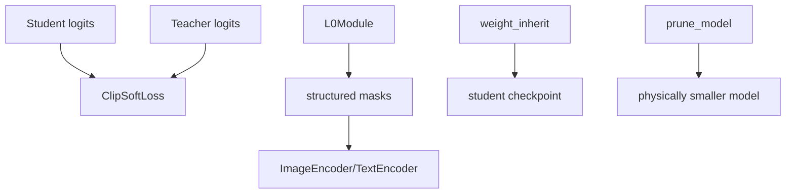

# Distillation And Pruning

> Primary sources: `src/open_clip/clip_soft_loss.py`,
> `src/open_clip/l0module.py`, `src/open_clip/weight_inherit.py`.

## 1 Overview

TinyCLIP compresses a teacher CLIP model using affinity mimicking (soft
cross-modal logits) and weight inheritance (structural parameter reuse).
During auto-inheritance training, L0 masks learn which dimensions to keep.

## 2 Component Diagram

## 3 Soft Loss

`ClipSoftLoss` gathers features across the distributed world, computes student
and teacher similarities, then applies cross-entropy between student logits
and teacher softmax probabilities.

> Sources: [src/open_clip/clip_soft_loss.py:10-77]().

## 4 L0 Masking

`L0Module` parameterizes logits over hidden dimensions, attention heads,
intermediate dimensions, and layers. A hard-concrete distribution produces
masks during training; deterministic hard masks are used at eval.

Key methods:

| Method | File | Line | Purpose |
|--------|------|------|---------|
| `forward` | `src/open_clip/l0module.py` | 287 | Sample masks. |
| `lagrangian_regularization` | `src/open_clip/l0module.py` | 201 | Push expected sparsity to target. |
| `calculate_model_size` | `src/open_clip/l0module.py` | 267 | Estimate remaining/pruned parameters. |
| `l0_mask` | `src/open_clip/l0module.py` | 302 | Return deterministic masks. |

## 5 Weight Inheritance

`weight_inherit` groups teacher parameters by depth, samples a subset of
layers with an interval strategy, and copies leading dimensions into the
smaller student state dict. QKV weights are reshaped carefully to preserve
head dimension ordering.

> Sources: [src/open_clip/weight_inherit.py:71-171]().

## 6 Physical Pruning

After mask warmup, `train_one_epoch` fuses masks and rebuilds encoders with
smaller tensors at `--prune-step`. `model.prune_model` performs the same
operation for loaded auto-inheritance checkpoints.

> Sources: [src/training/train.py:340-402](),
> [src/open_clip/model.py:1415-1458]().
