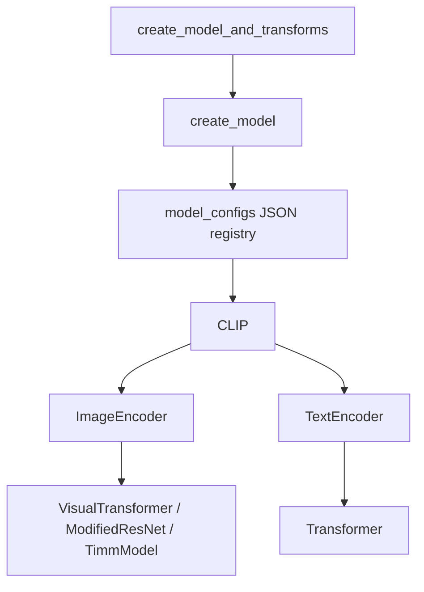
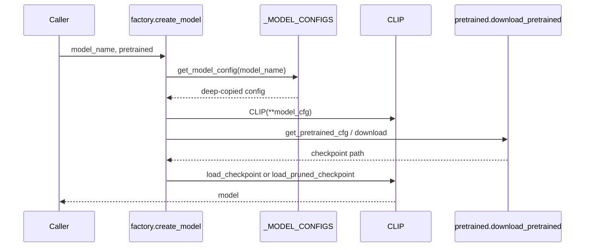

# Model Construction

> Primary sources: `src/open_clip/factory.py`, `src/open_clip/model.py`.

## 1 Overview

The model library loads architecture definitions from JSON files, constructs
the `CLIP` model, applies optional pretrained or pruned weights, and returns
the model plus image transforms.

## 2 Architecture



The config registry is populated at import time by scanning
`src/open_clip/model_configs/*.json`.

> Sources: [src/open_clip/factory.py:30-54](),
> [src/open_clip/model.py:1073-1099]().

## 3 Key Interfaces

| Function | File | Line | Purpose |
|----------|------|------|---------|
| `create_model` | `src/open_clip/factory.py` | 97 | Build and optionally load a model. |
| `create_model_and_transforms` | `src/open_clip/factory.py` | 198 | Build model plus train/val transforms. |
| `get_tokenizer` | `src/open_clip/factory.py` | 62 | Return HF or simple tokenizer. |
| `list_models` | `src/open_clip/factory.py` | 229 | List known model config names. |
| `add_model_config` | `src/open_clip/factory.py` | 234 | Register an external config path. |

## 4 Execution Flow



> Sources: [src/open_clip/factory.py:97-195]().

## 5 Checkpoint Handling

- Ordinary checkpoints use `load_checkpoint`.
- Auto-inheritance checkpoints use `load_pruned_checkpoint`, followed by
  `prune_model`, which physically removes masked dimensions.

> Sources: [src/open_clip/factory.py:83-96](),
> [src/open_clip/model.py:1415-1458]().

## 6 Usage

```python
import open_clip

model, _, preprocess = open_clip.create_model_and_transforms(
    "TinyCLIP-ViT-8M-16-Text-3M",
    pretrained="YFCC15M",
)
tokenizer = open_clip.get_tokenizer("TinyCLIP-ViT-8M-16-Text-3M")
```
