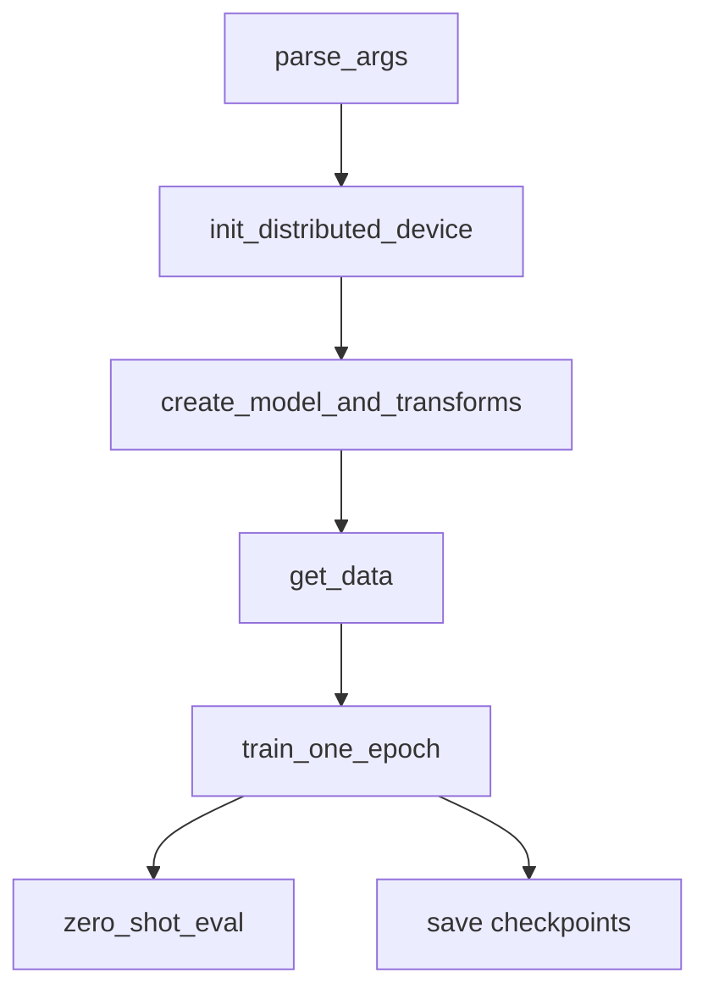

# Training Pipeline

> Primary sources: `src/training/main.py`, `src/training/data.py`,
> `src/training/train.py`, `src/training/zero_shot.py`.

## 1 Overview

The training pipeline supports WebDataset, CSV, ImageNet, and synthetic
inputs; NCCL/CPU distributed execution; hard and soft CLIP losses; and
periodic ImageNet zero-shot evaluation.

## 2 Startup Flow

## 3 Dataset Layer

`get_data` dispatches on `--dataset-type` to one of:

| Dataset Type | Builder | File |
|--------------|---------|------|
| webdataset | `get_wds_dataset` | `src/training/data.py:346` |
| csv | `get_csv_dataset` | `src/training/data.py:470` |
| synthetic | `get_synthetic_dataset` | `src/training/data.py:528` |
| ImageNet val/v2 | `get_imagenet` | `src/training/data.py:125` |

Training data must provide `num_samples`, `num_batches`, and epoch-aware
shuffle/sampling metadata through `DataInfo`.

> Sources: [src/training/data.py:35-616]().

## 4 Distributed Layer

`init_distributed_device` supports Horovod, SLURM environment variables, and
`torchrun`/`torch.distributed.launch`. It writes `RANK`, `LOCAL_RANK`, and
`WORLD_SIZE` back to the environment for downstream utilities.

> Sources: [src/training/distributed.py:69-102]().

## 5 Training And Evaluation

`train_one_epoch` handles precision contexts, teacher inference, hard/soft
loss combination, L0 mask fusion at the prune step, gradient clipping, mixed
precision, logging, and checkpointing.

`evaluate` delegates ImageNet zero-shot evaluation to `zero_shot_eval`, which
builds a distributed text classifier and computes top-1/top-5 accuracy.

> Sources: [src/training/train.py:86-664](),
> [src/training/train.py:709-755](),
> [src/training/zero_shot.py:110-132]().

## 6 Logging And Metrics

Metrics are accumulated with `AverageMeter`, reduced across ranks with
`reduce_tensor`, and optionally written to TensorBoard and Weights and
Biases.

> Sources: [src/training/my_meter.py:10-57](),
> [src/training/train.py:409-468]().
